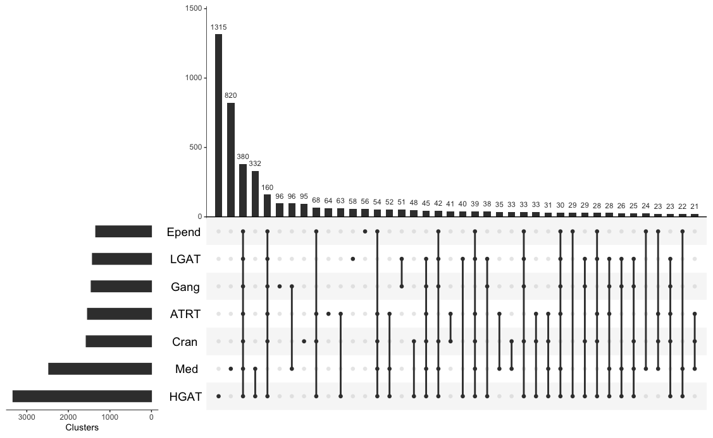

# Histology specific

Module authors: Ammar Naqvi (@naqvia)

The purpose of this module is to identify histology specific aberrant splicing events

## Usage
### script to run analysis
<br>**Run shell script to make final tables to be used for plotting below**
```
./compute_specific_as.sh
```
Input files:
```
input/pbta-histologies.tsv
input/filtered_samples_files.v2.txt
```

Output files:
```
results/perc_hist_as.*tsv
```


<br>


## Folder content
* `compute_specific_as.sh` shell script to pre-process histology file and run analysis
* `find_specific_as.pl`  cript to pre-process histology file and filter for strong splicing events
* `upsetR_of_hist.R` upsetR plot of aberrant splicing events for each histology, outputting to `plots/*png`
