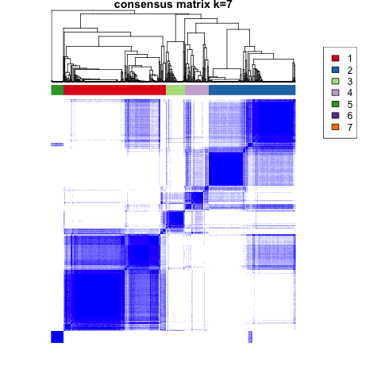

# Pan Cancer

Module authors: Ammar Naqvi (@naqvia)

The purpose of this module is to obtain a global view of alternative splicing by assessing total aberrant splicing indices per histology and assessing splicing changes with genomic mutations and RNA- fusions.

## Usage
### Consensus clustering:
<br>**Preprocessing and create matrix of inclusion/psi levels**
```
./create_matrix_of_PSI.pl <pbta-histologies.RNA-Seq> <filtered_samples_files.txt>
```

<br>**Run consensus clustering method and compute clusters**
```
Rscript consensus_clustering.R
```
Input files:
```
data/pbta-histologies.RNA-Seq
data/filtered_samples_files.txt
tables generated from `create_matrix_of_PSI.pl` run
```

Output files:
```
results/pan_cancer_splicing.thr10.report_all.txt
plots/*png
```




### Compute splicing index clustering:
<br>**Genrate splicing index plot, similar to TMB**

```
/generate_splicing_index_tab.pl <pbta-histologies.RNA-Seq.initial.tsv> <filtered_samples_files.txt>
```
```
Rscript splicing_index.R
```

Input files:
```
data/pbta-histologies.tsv
data/filtered_samples_files.txt
results/splicing_index.wdPSI.txt
```

Output files:
```
plots/splicing_index_cdf_current.pdf
```


### Oncoplot with mutations, fusions, and splicing for HGATs:
<br>**Preprocessing and create matrix of inclusion/psi levels**
```
./create_matrix_of_PSI_HGATs.pl <pbta-histologies.RNA-Seq.initial.tsv> <filtered_samples_files.txt>
```
```
Rscript create_oncoplot_of_splicing_w_filters.R
```

Input files:
```
data/pbta-histologies.tsv
data/filtered_samples_files.txt
results/hgat.diffsplicing.psi.txt
```

Output files:
```
plots/oncoplot*pdf
```


## Folder content

* `create_matrix_of_PSI.pl` prepares, filters, and constructs data table for downstream clustering analysis and output file to `results/pan_cancer_splicing.thr10.report_all.txt`
* `consensus_clustering.R` takes the files from above and generates clustering in `plots/consensus*png`
* `generate_splicing_index_tab.pl` generates ggplot data table for splicing index, outputs file to `results/splicing_index.wdPSI.txt`
* `Rscript splicing_index.R` takes the files from above and generates CDF plot (similar to TMB) in `plots/splicing_index_cdf_current.pdf`
* `create_matrix_of_PSI_HGATs.pl` prepares, filters, and constructs data table woth healthy comparisons of dPSI for downstream , outputs file to `results/hgat.diffsplicing.psi.txt`
* `Rscript create_oncoplot_of_splicing_w_filters.R` takes the files from above and generates oncoplot with given gene lists in `plots/oncoplot_of_hgat*.pdf`
