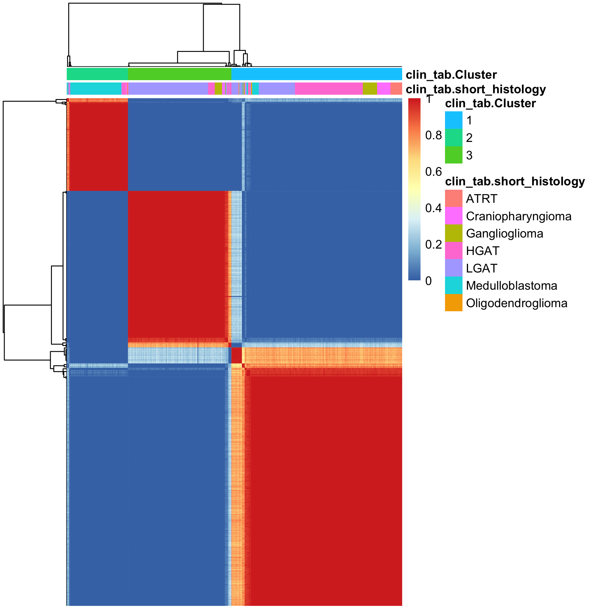
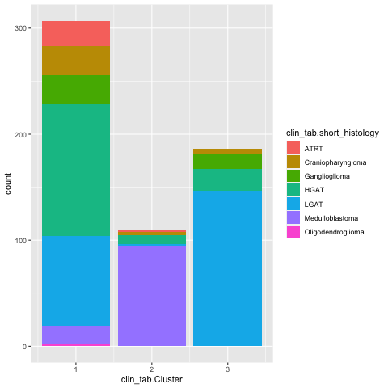
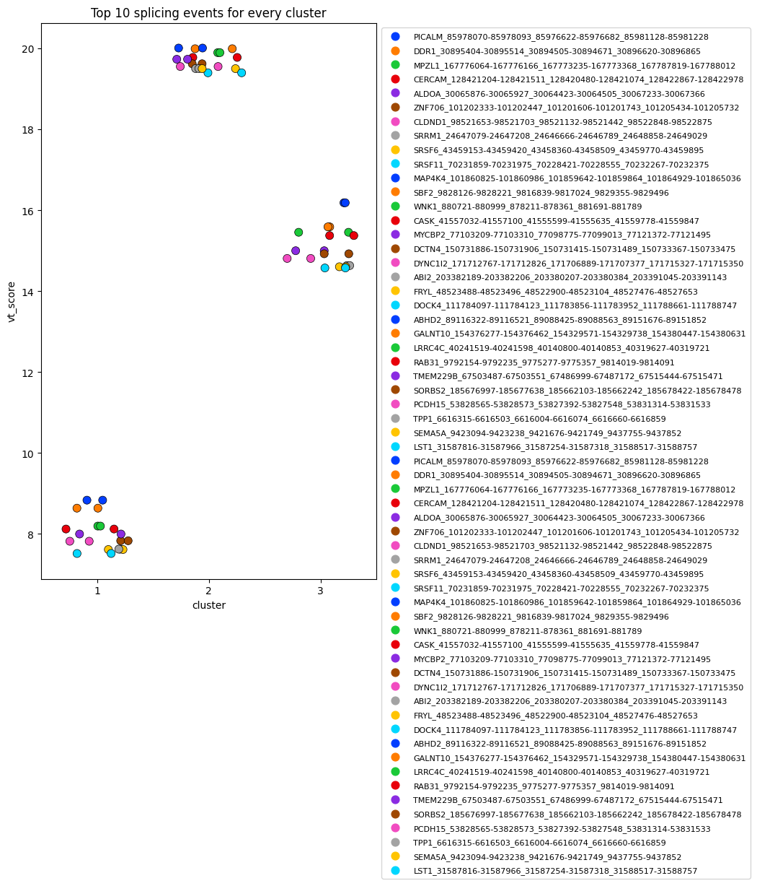
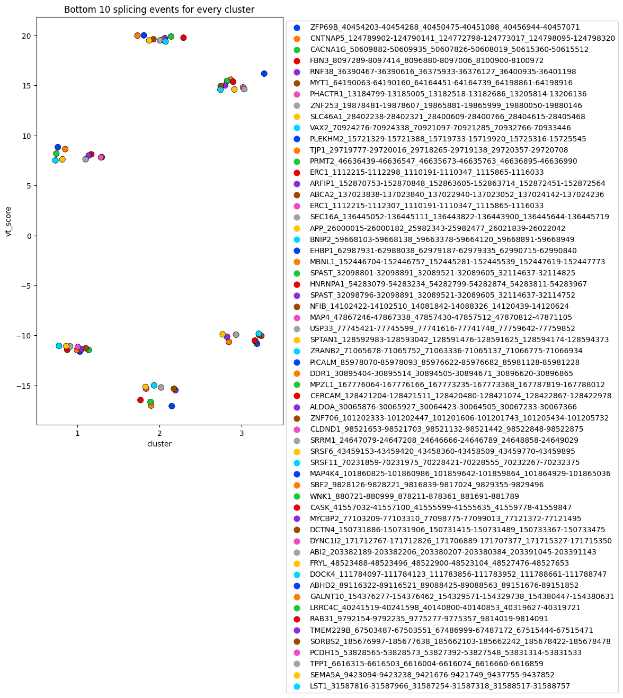

# Splicing-based clustering

Module authors: Ammar Naqvi (@naqvia)

The purpose of this module is to clustering based on PSI values

## Usage
### script to run analysis
<br>**Run shell script to make final tables to be used for plotting below**
```
./run_module.sh ../../data/v19_plus_20210311_pnoc_rna.tsv
```
Input files:
```
../../data/v19_plus_20210311_pnoc_rna.tsv
```

Output files:
```
results/CC_groups.txt
results/pan_cancer_splicing_SE.txt
results/pan_cancer_splicing_SE.vtest_tmp.txt
```


<br>

<br>

<br>


## Folder content
* `run_module.sh` shell script to pre-process histology file and run analysis
* `create_matrix_of_PSI_SE.pl` generates matrix of PSIs of each sample and splicing event
* `consensus_clustering.R` takes PSI matrix and impliments consensus clustering, plots heatmap and stacked barplot of cluster members, outputting to `plots/*png`
* `vtest_calc.py` calculates vt score based on PSI matrix and plots top 20`
