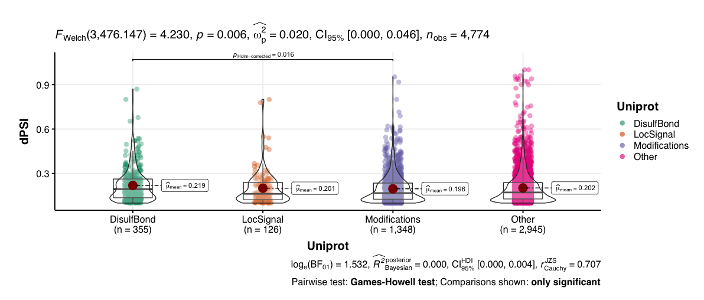
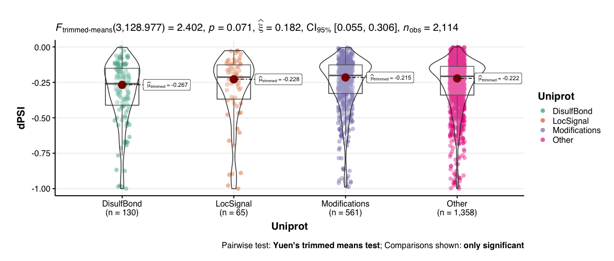

# Splicing Overlapping Functional Sites

Module authors: Ammar Naqvi (@naqvia)

The purpose of this module is to identify splicing events that result in loss/gain of functional sites (as-defined by Uniprot)

## Usage
### Consensus clustering:
<br>**Create summary table of all strong aberrant splicing events**
```
./ perl extract_recurrent_splicing_events.pl <pbta-histologies.tsv>
```

<br>**Run shell script to call bedtools and make final tabs for plotting**
```
./make_final_tabs.sh
```

<br>**Run R script for plotting**
```
Rscript splicing_functional_sites.R
```

Input files:
```
data/pbta-histologies.RNA-Seq
data/filtered_samples_files.txt
tables generated from `extract_recurrent_splicing_events.pl` run
unipDisulfBond.hg38col.bed
unipDomain.hg38.col.bed
unipLocSignal.hg38.col.bed
unipMod.hg38.col.bed
unipOther.hg38.col.bed
```

Output files:
```
results/psplicing_events.dpsi10.jc10.rec2.tsv splicing_events.dpsi10.jc10.single.tsv
results/psplicing_events.dpsi10.jc10.rec2.tsv splicing_events.dpsi10.jc10.single.bed
dominant_events_lsvs.total.rec2.intersectUnip.ggplot.txt
dominant_events_lsvs.total.rec2.intersectUnipMod.wo.txt
dominant_events_lsvs.total.rec2.intersectUnipOther.wo.txt
dominant_events_lsvs.total.rec2.intersectUnipDisulfBond.wo.txt
dominant_events_lsvs.total.rec2.intersectUnipLocSignal.wo.txt
dominant_events_lsvs.total.rec2.intersectUnipDomain.wo.txt
dominant_events_lsvs.total.rec2.pos.intersectUnip.ggplot.txt
dominant_events_lsvs.total.rec2.neg.intersectUnip.ggplot.txt
```


<br>



## Folder content

* `extract_recurrent_splicing_events.pl` processing output from rMATS with filters and constructs data table for all downstream analysis and output file to `results/splicing_events.dpsi10.jc10.tsv` and `splicing_events.dpsi10.jc10.bed`
* `make_final_tabs.sh` takes the files from above and generates table with uniprot overlaps to be used for plotting
* `splicing_functional_sites.R` generates ggplot violin plots of average dPSI per event identidied overlapping a functional site, outputting to `plots/*png`
