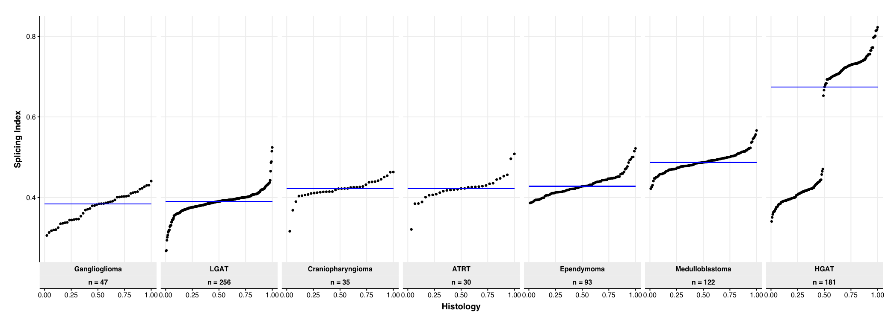

# Splicing index

Module authors: Ammar Naqvi (@naqvia)

The purpose of this module is to compute the splicing index of each tumor (proportion of mis-spliced events)

## Usage
### script to run analysis
<br>**Run shell script to make final tables to be used for plotting below**
```
./SI_run.sh
```
Input files:
```
input/pbta-histologies.tsv
input/filtered_samples_files.v2.txt
```

Output files:
```
results/splicing_index.wdPSI10_per_sample.txt
```


<br>


## Folder content
* `SI_run.sh` shell script to pre-process histology file and run analysis
* `splicing_index.R` takes SI matrix and plots CDF plots, outputting to `plots/*png`
