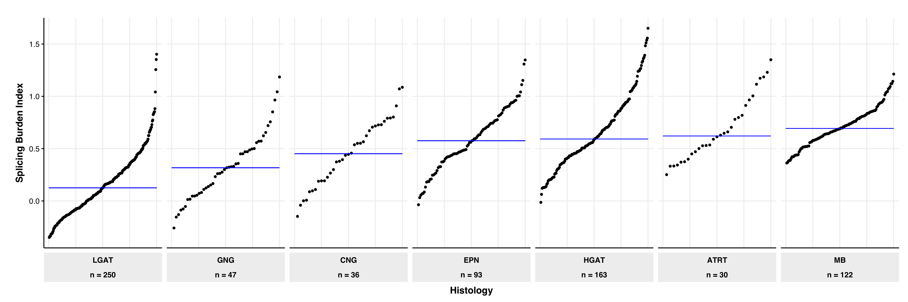

# Splicing index

Module authors: Ammar Naqvi (@naqvia)

The purpose of this module is to compute the splicing index of each tumor (proportion of mis-spliced events)

## Usage
### script to run analysis
<br>**Run shell script to make final tables to be used for plotting below**
```
./run_module.sh
```
Input files:
```
../../data/v19_plus_20210311_pnoc_rna.tsv
../../data/merge_rMATS_splicing.SE.single.tsv
```
Output files:
```
results/splicing_index.total.txt
```


<br>


## Folder content
* `run_module.sh` shell script to pre-process histology file and run analysis
* `01-generate_splicing_index_tab_using_tumors.pl` processes rMATs output and computes splicing burden index for each
* `02-plot_splicing_burden_index.R` takes splicing index burden values and generates CDF plot
* `03-generate_hist_spec_events_tab_using_tumors.pl` creates list of splicing events with histologies to be used to generate UpSetR plot
* `04-plot_histology-specific_splicing_events.R` creates UpSetR plot of splicing events as per histologies
* `05-plot_diffExp_highlowSBI.R` compute differential gene and generated volcano plot of low vs high splicing burden samples
